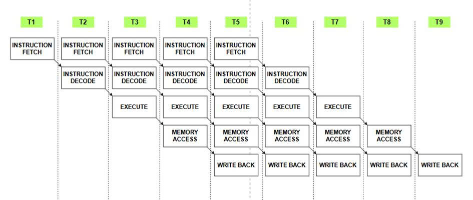
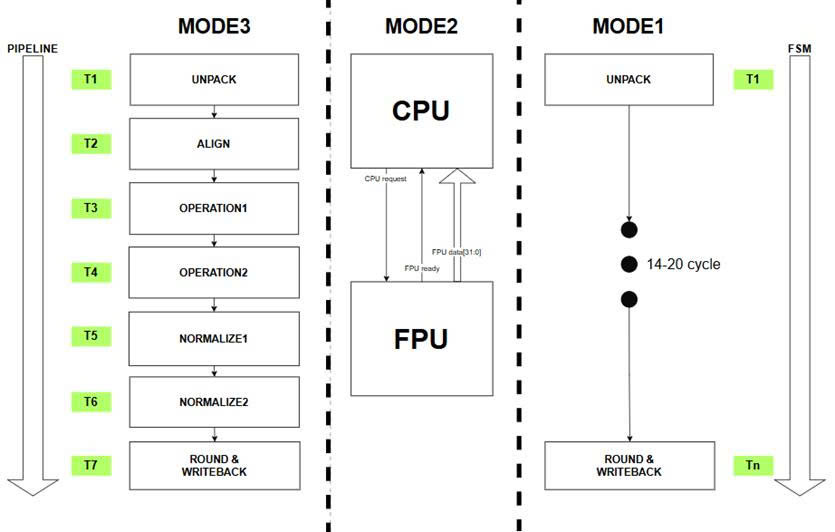
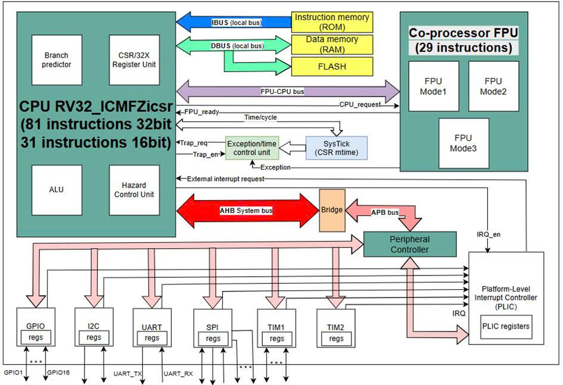
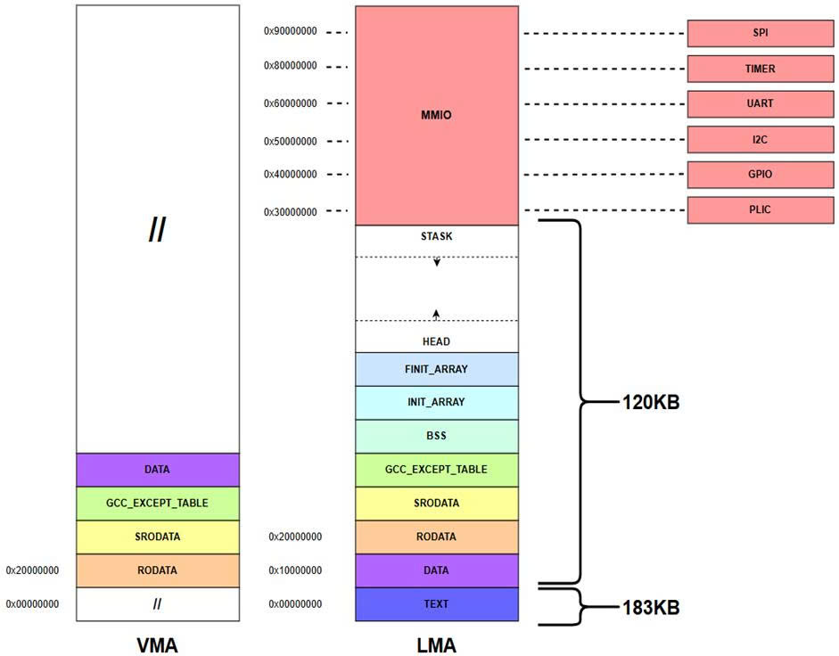
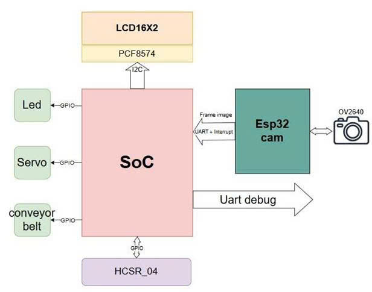

# SoC_WINRV32ICMF
Dự án SoC tập trung vào tối ưu hiệu suất mục tiêu để chạy mô hình phân loại AI với CPUpipeline sử dụng kiến trúc tập lệnh RISC-V 32 bit bao gồm tập lệnh cơ sở I, tập lệnh mở rộng M, tập lệnh mở rộng C và tập lệnh mở rộng F. Tích hợp bộ đồng xử lý FPUpipeline, hỗ trợ 62 ngắt, các ngoại vi I2C, SPI, UART, TIMER, GPIO, PLIC, dự đoán rẽ nhánh, quản lý phụ thuộc dữ liệu, etc. (The SoC project focuses on performance optimization targeted at running AI classification models with a CPU pipeline using a 32-bit RISC-V instruction set architecture. This includes the base instruction set I, extension M, extension C, and extension F. It integrates a pipelined FPU coprocessor, supports 62 interrupts, I2C, SPI, UART, TIMER, GPIO, PLIC peripherals, branch prediction, data dependency management, etc.)
- Tập lệnh cơ sở I: Bao gồm các lệnh toán học, logic, chuyển điều khiển cơ bản bắt buộc phải có của mỗi bộ xử lý RISC-V. (Base instruction set I: Includes basic arithmetic, logic, and control transfer instructions that are mandatory for every RISC-V processor.)
- Tập lệnh mở rộng M: Bổ xung thêm các lệnh nhân, chia, chia dư. Trong dự án này ALU sử dụng thuật toán radix-4 cho cả phép nhân và phép chia. Nhân sẽ mất 9 chu kì và chia mất 20 chu kì. (Extension M: Adds multiplication, division, and remainder instructions. In this project, the ALU uses the radix-4 algorithm for both multiplication and division. Multiplication will take 9 cycles and division takes 20 cycles.)
- Tập lệnh mở rộng C: Bổ xung thêm các lệnh 16 bit làm giảm độ dài mã chương trình tức giảm bộ nhớ lệnh cần sử dụng. (Extension C: Adds 16-bit instructions that reduce the length of program code, which means reducing the required instruction memory.)
- Tập lệnh mở rộng F: Bổ xung thêm các lệnh thao tác với số thực độ chính xác đơn. Tập này được bộ đồng xử lý FPU thực thi theo chuẩn IEEE754. (Extension F: Adds instructions for manipulating single-precision floating-point numbers. This set is executed by the FPU coprocessor according to the IEEE754 standard.)
  
SoC đầy đủ chức năng với bộ nhớ lệnh 190KB, bộ nhớ dữ liệu 120KB, Flash 10KB có thể hoạt động ở mức tần số 70MHz. Đối với các bộ nhớ đều 2KB hoạt động ở mức tần số 84MHz. Có thể thấy giới hạn rất lớn khi sử dụng nhiều block RAM và khó routing khi sử dụng nhiều tài nguyên. Đánh giá bằng báo cáo từ vivado với chiến lược tối ưu hiệu suất và FPGA CX7Z020clg400. (The fully functional SoC with 190KB instruction memory, 120KB data memory, and 10KB Flash can operate at a frequency of 70MHz. For memories of 2KB each, it operates at a frequency of 84MHz. It can be seen that there is a very large limitation when using many block RAMs and routing is difficult when using a lot of resources. Evaluated by reports from Vivado with a performance optimization strategy and FPGA CX7Z020clg400.)

Hệ thống SoC hoàn chỉnh sử dụng 12K logic unit, 7KFF với 2KB bộ nhớ lệnh và dữ liệu. 17K logic unit, 9KFF với đầy đủ dung lượng bộ nhớ - 187KB bộ nhớ lệnh, 120KB bộ nhớ dữ liệu, 10KB FLASH. Chủ yếu tốn tài nguyên ở FPU với 9k5 logic unit và 3k8FF khi đầy đủ dung lượng các bộ nhớ. Đánh giá báo cáo từ vivado với chiến lược tối ưu hiệu suất và FPGA CX7Z020clg400. (The complete SoC system uses 12K logic units, 7K FFs with 2KB instruction and data memory. It uses 17K logic units, 9K FFs with full memory capacity - 187KB instruction memory, 120KB data memory, 10KB FLASH. Resources are mainly consumed in the FPU with 9.5K logic units and 3.8K FFs when memories are at full capacity. Evaluated by reports from Vivado with a performance optimization strategy and FPGA CX7Z020clg400.)
## 1. CPU 
- Được thiết kế tối ưu hiệu suất với thông lượng của tất cả các lệnh đều là 1 lệnh mỗi chu kì ngoại trừ lệnh JALR với thông lượng 0.25 lệnh mỗi chu kì. CPU áp dụng kĩ thuật đường ống 5 chu kì cơ bản IF-ID-EX-MEM-WB. (Designed for performance optimization with the throughput of all instructions being 1 instruction per cycle, except for the JALR instruction with a throughput of 0.25 instructions per cycle. The CPU applies the basic 5-cycle pipeline technique IF-ID-EX-MEM-WB.)
- Hỗ trợ dự đoán rẽ nhánh với bộ dự đoán rẽ nhánh 2 bit kết hợp với bảng lịch sử rẽ nhánh. Bộ dự đoán rẽ nhánh hoạt động hiệu quả đối với chương trình C/C++ mang tính lặp lại như hàm while, for, etc tuy nhiên hoạt động kém hiệu quả đối với loại chương trình mang tính lúc nhảy lúc không như zich zac. Đối với mô hình AI trong dự án tỷ lệ dữ đoán rẽ nhánh đúng rơi vào khoảng từ 98% tới 99% do chương trình AI có tính lặp lại nhiều lần cho mỗi pixel ảnh. Dự đoán rẽ nhánh sai sẽ phải trả giá bằng 2 chu kì tần số. (Supports branch prediction with a 2-bit branch predictor combined with a branch history table. The branch predictor operates efficiently for repetitive C/C++ programs such as while, for functions, etc., however, it operates inefficiently for types of programs that have a sometimes jumping, sometimes not jumping nature like zigzag. For the AI model in the project, the correct branch prediction rate falls around 98% to 99% because the AI program has a highly repetitive nature for each image pixel. A wrong branch prediction will pay the price of 2 clock cycles.)

  
   
  <i>Hình 1: Nguyên lý dự đoán của bộ dự đoán rẽ nhánh(Figure 1: Prediction principle of the branch predictor)</i>

- Hỗ trợ bộ quản lý ngắt giúp chương trình điều khiển được ngắt của hệ thống bao gồm ngắt ngoài, ngoại lệ của từng chế độ. Tuy nhiên bộ xử lý chỉ hỗ trợ chế độ máy tức là chế độ có quyền cao nhất. (Supports an interrupt manager helping the program control system interrupts, including external interrupts and exceptions of each mode. However, the processor only supports machine mode, which is the highest privilege mode.)

  
   
  <i>Hình 2: Đường ống CPU(Figure 2: CPU Pipeline)</i>

- Hỗ trợ quản lý phụ thuộc dữ liệu với chức năng xử lý tất cả các loại phụ thuộc dữ liệu mà không phải trả giá ngoại trừ lệnh JALR sẽ được chèn thêm 3 lệnh nop. Xung đột tài nguyên xảy ra khi truy cập cả lệnh và dữ liệu sẽ được xử lý bằng kiến trúc máy tính Harvard. (Supports data dependency management with the function of handling all types of data dependencies without paying a penalty, except for the JALR instruction which will have 3 nop instructions inserted. Resource conflicts occurring when accessing both instructions and data will be handled using the Harvard computer architecture.)
- Khối số học và logic xử lý các lệnh nhân chi số nguyên bằng thuật toán Radix-4, riêng với nhân Radix-4 sẽ được thực thi song song làm tăng tài nguyên và diện tích sử dụng tuy nhiên sẽ đẩy nhanh quá trình tính toán. (The arithmetic and logic unit processes integer multiplication and division instructions using the Radix-4 algorithm. Specifically, the Radix-4 multiplication will be executed in parallel, increasing resource and area utilization but will accelerate the calculation process.)
- Hỗ trợ 4 được bus riêng bao gồm Ibus, Dbus sử dụng localbus; Bus ngoại vi sử dụng AHB và APB; Bus FPU-CPU sử dụng bus đăc biệt được thiết kế riêng phù hợp yêu cầu trao đổi giữa CPU và FPU. (Supports 4 separate buses including Ibus and Dbus using localbus; peripheral bus using AHB and APB; FPU-CPU bus using a special bus custom-designed to suit the exchange requirements between the CPU and FPU.)
## 2. FPU
- Đươc thiết kế với 3 chế độ hoạt động bao gồm ModePipeline, ModeFSM và ModeCom. ModeCom thực thi các lệnh cần trao đổi dữ liệu với CPU thực thi ngay lật tức theo kiểu logic tổ hợp, ModeFSM thự thi các lệnh như FDIV, FSQRT là các lệnh cần thời gian tính toán lên tới 20 chu kì mỗi lệnh vì vậy không hợp ghép vào đường ống mà sẽ được thực thi bằng máy trạng thái. ModePipeline thực thi hầu hết các lệnh tính toán của FPU áp dụng kĩ thuật đường ống 7 chu kì Unpack-Align-Ope1-Ope2-Nor1-Nor2-R&WB. Ở trường hợp lý tưởng FPU hoạt động ở ModePipeline, không có phụ thuộc dữ liệu, các lệnh thực thi đều là thuộc dạng tích lũy FMA(Fused Multiply-Add) thông lượng là 1FMA/cycle tương đương 2 phép tính số thực mỗi chu kì. (Designed with 3 operating modes including ModePipeline, ModeFSM, and ModeCom. ModeCom executes instructions that need to exchange data with the CPU, executing immediately in a combinational logic style. ModeFSM executes instructions such as FDIV and FSQRT, which are instructions that require a calculation time of up to 20 cycles per instruction; therefore, they are not suitable to be integrated into the pipeline but will be executed by a state machine. ModePipeline executes most of the calculation instructions of the FPU, applying a 7-cycle pipeline technique: Unpack-Align-Ope1-Ope2-Nor1-Nor2-R&WB. In the ideal case where the FPU operates in ModePipeline, there are no data dependencies, and the executed instructions are all of the FMA (Fused Multiply-Add) accumulation type, the throughput is 1 FMA/cycle, equivalent to 2 floating-point calculations per cycle.)
- Thuật toán nhân sử dụng là Radix4 song song theo kiểu số thực, thuật toán chia sử dụng là Newton-Raphson, thuật toán căn bậc 2 sử dụng là dự đoán digit-by-digit theo kiểu số thực, etc. Tất cả các lệnh của FPU đề có độ chính xác và tuân theo tiêu chuẩn IEEE754. (The multiplication algorithm used is parallel Radix-4 in floating-point style, the division algorithm used is Newton-Raphson, the square root algorithm used is digit-by-digit prediction in floating-point style, etc. All instructions of the FPU are precise and comply with the IEEE754 standard.)

  
   
  <i>Hình 3: Nguyên tắc xử lý lệnh của FPU(Figure 3: Instruction processing principle of the FPU)</i>

## 3. Ngoại vi (Peripherals)
- Hỗ trợ ngoại vi I2C, SPI, UART, TIMER, GPIO và PLIC. (Supports I2C, SPI, UART, TIMER, GPIO, and PLIC peripherals.)
- UART Hỗ trợ chức năng lựa chọn baud rate 600bps, 1200bps, 2400bps, 4800bps, 9600bps, 14400bps, 19200bps, 38400bps, 56000bps, 57600bps và 115200bps. Chỉ hỗ trợ báo cáo trạng thái bận và RXNE. Có 2 đường ngắt nối tới PLIC là ngắt báo đã truyền xong dữ liệu và ngắt báo nhận được dữ liệu. (The UART supports baud rate selection of 600bps, 1200bps, 2400bps, 4800bps, 9600bps, 14400bps, 19200bps, 38400bps, 56000bps, 57600bps, and 115200bps. It only supports reporting busy and RXNE statuses. It has 2 interrupt lines connected to the PLIC: data transmission complete interrupt and data received interrupt.)
- Ngoại vi I2C được trang bị đầy đủ chức năng, hỗ trợ người dùng dự động hóa hết tất cả các thao tác. Để sử dụng chỉ việc khởi tạo I2C tiếp tới đưa dữ liệu vào thanh ghi gữ liệu và bật truyền, mọi thứ còn lại sẽ được phần cứng lo. Các chức năng hỗ trợ như lựa chọn độ dài địa chỉ slave, lựa chọn có truyền địa chỉ thanh ghi không, lựa chọn truyền, nhận bao nhiêu byte, lựa chọn độ rộng xung SCL, lựa chọn vị trí lấy mẫu và tùy chọn có repeatstart hay không. Hỗ trợ báo cáo trạng thái ngoại vi như bận, có nhận diện được slave không, RXNE, cờ báo lỗi, cờ báo hoàn thành nhận và cờ báo hoàn thành truyền. Có thể lựa chọn tần số SCL như 10KHz, 20KHz, 50KHz, 100KHz, 150KHz, 200KHz, 250KHz, 400KHz. (The I2C peripheral is fully featured, supporting users to automate all operations. To use it, simply initialize the I2C, then load data into the data register and enable transmission; everything else will be handled by the hardware. Supported features include selecting slave address length, choosing whether to transmit the register address, selecting how many bytes to transmit/receive, selecting SCL pulse width, selecting the sampling position, and the option for a repeated start. It supports reporting peripheral statuses such as busy, slave acknowledged/detected, RXNE, error flag, receive complete flag, and transmit complete flag. SCL frequencies can be selected from 10KHz, 20KHz, 50KHz, 100KHz, 150KHz, 200KHz, 250KHz, and 400KHz.)
- Ngoại vi GPIO cung cấp 16 chân tín hiệu mục đích chung có thể cấu hình vào ra tùy ý. Có thể đọc, ghi tùy ý. Ngoại vi GPIO có 32 đường tín hiệu ngắt nối tới PLIC bao gồm 16 tín hiệu ngắt báo phát hiện sườn lên của GPIO và 16 tín hiệu ngắt báo phát hiện sườn xuống của GPIO. (The GPIO peripheral provides 16 general-purpose signal pins that can be arbitrarily configured as input or output. They can be read or written arbitrarily. The GPIO peripheral has 32 interrupt signal lines connected to the PLIC, including 16 interrupt signals for GPIO rising edge detection and 16 interrupt signals for GPIO falling edge detection.)
- Bộ định thời TIMER bản chất được cấu tạo từ 2 khối là khối đếm và khối chức năng nâng cao và cả 2 khối có thể hoạt động đồng thời. Tức là có thể vừa dùng timer để tạo trễ vừa dùng để xuất xung PWM hoặc dùng chức năng Capture đưa ra độ rộng xung đưa vào. Khối đếm hỗ trợ tùy chọn tự động nạp lại, lựa chọn đếm lên đếm xuống, lựa chọn tải giá trị vào thanh ghi đếm, lựa chọn bộ chia tần, lựa chọn chu kì đếm. Khối đếm này có 1 đường ngắt nối tới PLIC báo tràn. Khối chức năng nâng cao cung cấp 4 channel timer hỗ trợ chức năng PWM hoặc Capture có thể cấu hình. Có chức năng lựa chọn channel, chức năng lựa chọn kích hoạt số lượng channel, chức năng thay đổi chân đầu ra đảo lại cho từng channel, chức năng lựa chọn cực tính của tín hiệu, lựa chọn bộ chia tần, lựa chọn chu kì đếm và lựa chọn giá trị so sánh. (The TIMER peripheral is essentially composed of 2 blocks: a counter block and an advanced function block, and both blocks can operate simultaneously. This means it can be used to create delays while simultaneously outputting PWM pulses or using the Capture function to measure input pulse width. The counter block supports auto-reload options, up/down counting selection, loading values into the counter register, prescaler selection, and counting period selection. This counter block has 1 interrupt line connected to the PLIC for overflow indication. The advanced function block provides 4 timer channels supporting configurable PWM or Capture functions. It has features for channel selection, enabling a specific number of channels, inverting the output pin for each channel, selecting signal polarity, selecting the prescaler, selecting the counting period, and selecting the compare value.)
- Ngoại vi quản lý ngắt ngoài PLIC, hỗ trợ 62 ngắt các loại đến từ ngoại vi. Có khả năng cấu hình mức ưu tiên ngắt cho từng ngắt, cấu hình cho phép ngắt cho từng ngắt, cấu hình ngưỡng ngắt. Hỗ trợ đọc trạng thái của bộ quản lý ngắt như ngắt nào đang chờ, ngắt nào đang được thực hiện. Thời gian tìm ra ngắt cao nhất và báo cáo cho CPU là 32 chu kì. (The PLIC external interrupt management peripheral supports 62 various interrupts from peripherals. It has the ability to configure the interrupt priority level for each interrupt, configure interrupt enable for each interrupt, and configure the interrupt threshold. It supports reading the status of the interrupt manager, such as which interrupt is pending and which interrupt is currently being executed. The time to find the highest priority interrupt and report it to the CPU is 32 cycles.)
- Ngoại vi SPI hỗ trợ lựa chọn tần số SCLK là 100KHz, 200KHz, 500KHz, 800KHz, 1MHz, 2MHz, 4MHz, 5MHz. Có thể lựa chọn frame truyền lên tới 64bit, lựa chọn CPOL, CPHA, truyền MSB hay không. Có chức năng tự động chọn slave với ID của slave lưu trong thanh ghi cấu hình. Hỗ trợ cả chế độ master lẫn slave. Có 2 đường ngắt báo nhận được dữ liệu và đã truyền xong dữ liệu. Có thanh ghi trạng thái báo bận, RXNE... (The SPI peripheral supports selecting SCLK frequencies of 100KHz, 200KHz, 500KHz, 800KHz, 1MHz, 2MHz, 4MHz, and 5MHz. The transmission frame can be selected up to 64 bits, along with options for CPOL, CPHA, and whether to transmit MSB first. It has an automatic slave selection function with the slave ID stored in the configuration register. It supports both master and slave modes. It has 2 interrupt lines to report data received and data transmission complete. It has a status register reporting busy, RXNE...)
## 4. Mô hình hệ thống SoC (SoC System Model)

  
   
  <i>Hình 4: Sơ đồ kiến trúc tổng quan của SoC WINRRV32ICMF(Figure 4: Overall architecture diagram of the WINRRV32ICMF SoC)</i>

  
   
  <i>Hình 5: Phân vùng bộ nhớ(Figure 5: Memory map)</i>

## 5. Ví dụ hệ thống phân loại (Classification System Example)
- Bao bồm firmware có sẵn makefile, mã chương trình C/C++, thư viện thao các với ngoại vi, etc.(Includes firmware with an available makefile, C/C++ source code, peripheral interaction libraries, etc.)
- Mã nguồn verilog mô tả tất cả ngoại vi, CPU, FPU, ALU, etc.(Verilog source code describing all peripherals, CPU, FPU, ALU, etc.)

  
   
  <i>Hình 6: Mô hình phân loại sử dụng mô hình SoC(Figure 6: Classification model using the SoC system)</i>

- Mô hình phân loại nhận pixel ảnh từ ESP32CAM bằng UART + ngắt. Đọc cảm biến khoảng cách HCSR-04 bằng GPIO và systick, điều khiển băng truyền, led bằng GPIO. Điều khiển Servo bằng chức năng PWM của TIMER, hiển thị kết quả phân loại lên LCD bằng I2C. (The classification model receives image pixels from an ESP32CAM via UART + interrupt. It reads the HC-SR04 distance sensor using GPIO and SysTick, controls the conveyor belt and LEDs using GPIO. It controls the Servo using the PWM function of the TIMER, and displays the classification results on the LCD using I2C.)
